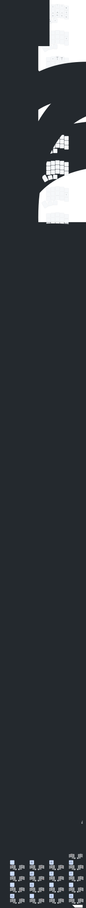

# Flo's Magic ZMK Config

## Structure
- **`config`**: Contains almost everything
  - See the `features` directory for a hierarchally organized list of features
- **`Analysis`**: Bigram analysis used to find AKs (Adaptive Keys)

## Alpha Layout: Naquadah
> **The driving question:** What if we built a layout that _required_ adaptive keys?

Naquadah is a heavy variation of HandsDown Titanium, it's so modified as a matter of fact, it's practically unrecognizable.
Its core principles are:
- Adaptive Keys are **NOT** optional (this layout is useless without AKs)
- It should feel like it "flows":
  - Extremely low SFB: **0.082%** (See `sfb.py` in `Analysis/scripts`)
  - Low Redirects (~<2%)
  - IN Rolls >> OUT Rolls
  - The few SFBs left should ideally be on syllable breaks
---
### Naquadah and its 46 AKs
_Note: This is designed for heavy colstag keyboards (Chocofi)_

```

Naquadah layout:
================
   w  m  p  k              /  .  -  =
x                                      '
   s  n  t  v              ,  a  e  i
c                                      h
   g  l  d  b              _  u  o  y
f                                      j

                r      ␣

The position of the special chars is still in flux (only . , ' are fixed)

The 46 accompanying AKs: (Note: This is RC2, it may evolve until the full release)
============
## SFB AKs ###################################
"A, => AU" 
"U_ => UA" 

"E= => EO" 
"O' => OE"  # Better than OH because of "Oh! really?"

"GF => GS" 

"LG => LL" 
"LX => LG"  # To remove SFB caused by LG => LM (aLGorithm)

"NP => NL"  # NP is rarely used in "flow", essentially mostly in "input". The rest is "un-" words

"MT => MN" 
"NX => NM" 

"PK => PT" 

"SR => SW" 
"WX => WS" 

"YH => YI"  # More comfortable than YJ => YI
"XS => XC" 

"WM => LM" 
##############################################


## IMPOSSIBLE Movements (on Chocofi) #########
"SX => SF" 
"MK => MB" 
"KM => BM"  # Useful because of the "MK => MB" muscle memory
"PB => NB"  # & Use alt-fingering
##############################################


## Comfort AKs ###############################
"DV => LV" 
"DK => LK" 
"VD => VL" 
"KD => KL" 
"DB => LB" 
"BD => BL" 
"DF => DV"  # To remove SFB caused by DV => LV


"TV => NV" 
"VT => VN" 

"PG => PL"  # For M->P->L, but also for regular P->L
"BG => BL"  # For M->B(k)->L
##############################################


## Repeat AKs ################################
## Only for pinkies & ring fingers (skipped II because it's so rare)
"E. => EE" 
"FG => FF" 
"SD => SS" 
"BC => BB" 
"CG => CC"  # CD would technically work, but it would make using the terminal a nightmare
"GC => GG" 
"PW => PP"  # Not using PM because of 6PM, 7PM, ...
"MW => MM" 
"NW => NN" 
"O. => OO"  # May need to increase the timing of adaptive keys to make this one more reliable
"RX => RR" 
"TG => TT" 
"DC => DD" 
##############################################


## Special Cases #############################
"hE. => hEI"
"hEU => hEY"
##############################################
```

## Concepts
_Many concepts are based on Alan's amazing work: [Hands Down Layouts](https://sites.google.com/alanreiser.com/handsdown/home/hands-down-neu)_


### Adaptive Keys (Alan Reiser)
Key behaving differently if pressed in quick successions. Virtually removes any remaining SFB
- It works with a combination of layers, macros, and behaviors
- It relies on the inner workings of the Macro queue implementation in ZMK
  - Very reliable (no missed keys in more than a year), but
    - It is sort of a hack
    - There are some very minor caveats, [combo hack](config/features/hands_down/adaptive_keys/combos.dtsi), and some issues in very specific cases when using HRMs)
    - Maintaining and debugging issues with this requires understading the inner workings of ZMK
    - Eventually I'd may implement this in ZMK directly, but for now this has worked flawlessly so I'm keeping it as is.
  - That being said, it works, and it works well (tested on burst words at 200wpm+)

<br/>

### Callum Style Mods (Callum)
After using HRMs for about a year, and tweaking everything I could tweak about it I felt it was a bottleneck. I had always looked down on Callum style mods until .... I actually tried it 😅. It's been love at first sight.
- One shot mods
- On tap, they chain and stack up
- On hold, they act as regular mods. With a special feature in ZMK to enable the mod being pressed while tap/hold is decided (useful for mouse actions)
- The mods layer (action layer) stay active for a few milliseconds after releasing
  - This is to ensure the correct tap/hold resolution
  - It guarantees we never have to think about the timing.
  - As long as the order is correct, it will work as expected
    - Correct order: 
      - Mod Layer Press -> Mod 1 -> Mod 2 -> Mod Layer Release 
      - Mod Layer Press -> Mod 1 -> Mod 2 press -> Mod Layer Release -> Mod 2 release
      - ...
    - Incorrect order:
      - Mod Layer Press -> Mod 1 -> Mod Layer Release -> Mod 2 press & release
      - ...
        
<br/>

### Other
- **Switch Device**: Switch the device and uses the associated layer
- **Linger Keys (Alan Reiser)**: Does 2 different action on short tap vs hold. Essentially a tap-hold.
- **Magic parenthesis**: One combo does 4 different types of parenthesis
  - Depends on how long it's held and whether or not it's shifted
- And probably more ...


# Layout
TODO: Fix visualization



<br/>
<br/>
<br/>
<br/>
<br/>
<br/>
<br/>
<br/>
<br/>

---
#### Note to self

- Try urob's timeless HRMs (?): https://www.reddit.com/r/ErgoMechKeyboards/comments/11gejh3/lpt_try_urobs_zmk_timeless_homerow_mods_combos/  
(and other small features)
